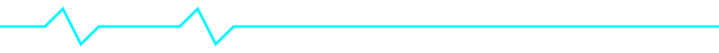

<!-- ========================================================= -->
<!--                DYNAMIC GITHUB PROFILE SYSTEM                -->
<!-- ========================================================= -->

<div align="center">
  
</div>

<h1 align="center">
  
</h1>


---

## 🟢 SYSTEM STATUS

```txt
────────────────────────────────────────────────────────────────
USER        : Amin Mistary
MODE        : BUILDING | INNOVATING | SCALING
FOCUS       : SOFTWARE • AI • DATA • FULL-STACK
STATE       : CONSISTENT > MOTIVATED > UNSTOPPABLE
LOCATION    : INDIA → GLOBAL (Remote-Ready)
VERSION     : v2.0.0-dynamic
UPTIME      : Always On
────────────────────────────────────────────────────────────────
```

## 🧠 STORY MODE

### PAST
- **Curious Explorer**: Started with a fascination for computers and systems
- **Logic Builder**: Mastered programming fundamentals through C & C++
- **Problem Solver**: Learned by breaking, fixing, and optimizing code
- **Self-Taught Hacker**: Built resilience through trial and error

### PRESENT
- **AIML Undergraduate**: Pursuing advanced studies in AI and Machine Learning
- **Full-Stack Developer**: Building end-to-end solutions with modern tech
- **Project Architect**: Designing scalable systems and innovative applications
- **Continuous Learner**: Daily coding, reading, and skill-building habits

### FUTURE
- **Global Software Engineer**: Leading teams in cutting-edge technologies
- **AI Innovator**: Creating intelligent systems that solve real-world problems
- **Product Visionary**: Developing products that make a meaningful impact

## ⏱️ CURRENT MISSION
<!-- STATUS:START -->
Learning advanced backend scalability techniques
Developing AIML-powered applications
Mastering distributed systems and cloud architecture
Contributing to open-source AI projects
<!-- STATUS:END -->

## 🧰 TECH STACK & TOOLS

### Languages


### Backend & Frameworks


### Databases


### Tools & Workflow


### Core Skills
- **Problem Solving**: Algorithm design and optimization
- **System Design**: Scalable architecture planning
- **AI/ML**: Model development and deployment
- **Full-Stack Development**: End-to-end application building

## 📊 PROJECTS & CONTRIBUTIONS
SOON


## 🎓 EDUCATION 

- **Diploma in Computer Science** - [MSBT], Completed: 2024
- **BE in Artificial Intelligence & Machine Learning** - [SPPU], Expected Graduation: 2027

## 📡 DYNAMIC SIGNALS

<div align="center">
  
</div>

<div align="center">
  
  
  <br>
  
  
</div>

- **Commits**: <span style="animation: blink 2s infinite;">Daily habits, not just noise</span>
- **Streaks**: <span style="color:#ff00ff; animation: pulse 1.5s infinite;">Discipline in action</span>
- **Repositories**: <span style="color:#00f7ff; animation: fadeIn 3s infinite;">Innovation experiments</span>
- **Contributions**: <span style="color:#00ff88; animation: slide 2s infinite;">Impact measurement</span>
- **Collaborations**: <span style="color:#ffff00; animation: bounce 1s infinite;">Team synergy</span>
- **Issues/PRs**: <span style="animation: glow 2s infinite;">Problem-solving journey</span>

<style>
@keyframes blink { 0%, 50% { opacity: 1; } 51%, 100% { opacity: 0; } }
@keyframes pulse { 0% { transform: scale(1); } 50% { transform: scale(1.05); } 100% { transform: scale(1); } }
@keyframes fadeIn { 0% { opacity: 0; } 50% { opacity: 1; } 100% { opacity: 0; } }
@keyframes slide { 0% { transform: translateX(0); } 50% { transform: translateX(5px); } 100% { transform: translateX(0); } }
@keyframes bounce { 0%, 20%, 50%, 80%, 100% { transform: translateY(0); } 40% { transform: translateY(-5px); } 60% { transform: translateY(-3px); } }
@keyframes glow { 0% { text-shadow: 0 0 5px #00f7ff; } 50% { text-shadow: 0 0 20px #00f7ff, 0 0 30px #00f7ff; } 100% { text-shadow: 0 0 5px #00f7ff; } }
</style>

## 🌐 CONNECT & COLLABORATE

<div align="center">
  <a href="https://linkedin.com/in/aminmistary">
    
  </a>
  </a>
  <a href="mailto:aminmistary@email.com">
    
  </a>
  <a href="https://aminmistary.dev">
    
  </a>
</div>

## ⚠️ SYSTEM LOG (EXPANDABLE)

<details>
  <summary>🔍 View Detailed System Metrics</summary>
  
  **Mistakes Made**: Countless, but each a learning opportunity
  **Lessons Learned**: Exponential growth through failure
  **Quit Probability**: 0% - Persistence is the ultimate skill
  **Growth Rate**: Accelerating with every challenge
  **Innovation Index**: High - Always pushing boundaries
  
</details>

## 🧭 CORE PRINCIPLES

> "I don't wait for motivation. I build systems that work even when motivation is gone."
> 
> "Code is poetry. Systems are symphonies. Innovation is revolution."

<div align="center">
  
</div>

---

<div align="center">
  <div style="display: inline-block; margin: 10px;">
    
  </div>
  <div style="display: inline-block; margin: 10px;">
    
  </div>
  <br>
  <div style="display: inline-block; margin: 10px;">
    
  </div>
  <div style="display: inline-block; margin: 10px;">
    
  </div>
  <br>
  
  <br>
  <em style="animation: fadeInOut 3s infinite;">Built with ❤️ and ☕ | Last Updated: <span id="last-updated"></span></em>
</div>

<style>
@keyframes fadeInOut {
  0%, 100% { opacity: 0.7; }
  50% { opacity: 1; }
}
</style>


<!-- ========================================================= -->
<!-- END OF DYNAMIC PROFILE SYSTEM -->
<!-- ========================================================= -->

---